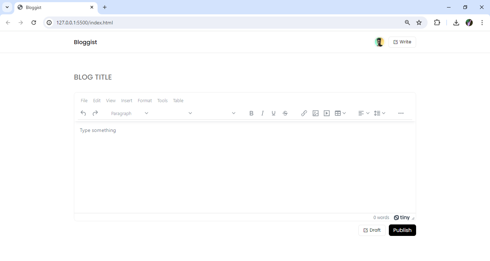

# BloggistApp

## Description
This project is a simple demonstration of an app frontend built using CSS, HTML, and JavaScript. It provides a user interface for a text editor, allowing users to input and manipulate text. However, the text cannot be saved, serving solely as a visual representation of the app's functionality.

## Features
- Text input area
- Basic text manipulation functionalities (e.g., formatting, styling)
- Responsive design for various screen sizes
- No save functionality (demonstrates frontend behavior without backend support)

## Technologies Used
- HTML
- CSS
- JavaScript

## Installation
This project does not require any installation. Simply clone the repository to your local machine to view the frontend.

## Usage
1. Open the `index.html` file in your web browser.
2. Use the text input area to input text.
3. Experiment with the available text manipulation functionalities.
4. Refresh the page to clear the text (no save functionality).

## Demo
[Link to live demo](https://bloggist-three.vercel.app/)

## Screenshots

## Contributing
Contributions are welcome! If you'd like to contribute to the project, please follow these steps:
1. Fork the repository.
2. Create your feature branch (`git checkout -b feature/AmazingFeature`).
3. Commit your changes (`git commit -m 'Add some AmazingFeature'`).
4. Push to the branch (`git push origin feature/AmazingFeature`).
5. Open a pull request.

## License
This project is licensed under the [MIT License](LICENSE).
